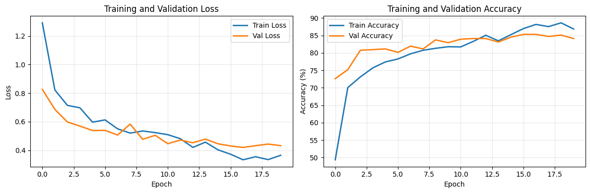

# Smart Trash Bin Project

This project aims to train a machine learning model to classify waste images into one of six categories:

- Cardboard
- Glass
- Metal
- Paper
- Plastic
- Trash

Such a model could be used in Smart Trash Bins that automatically sort waste.

## Project Structure

- **model.ipynb**: Main Jupyter notebook containing all code for data preparation, model training, validation, and testing. Includes:
	- Dataset and DataLoader preparation
	- Simple CNN and ResNet18 classifiers
	- Training, validation, and testing loops
	- Visualization of training results
	- Example inference on a test image
- **best_model.pth**: Best model checkpoint saved during training
- **final_model.pth**: Final model after training
- **training_history.png**: Plots of loss and accuracy for training and validation sets
- **data/**: Contains the dataset split into `train`, `valid`, and `test` folders, each with a `_classes.csv` file for labels

## Dataset

The dataset (~70MB) can be downloaded from [Roboflow](https://universe.roboflow.com/cybertech-qde01/waste-classification-q75av-awlnx).

Each image is labeled as one of the six classes. The CSV files in each split folder provide the mapping between filenames and classes.

## How to Use

1. Download the dataset and place it in the `data/` directory as structured above.
2. Open `model.ipynb` in Jupyter Notebook or VS Code.
3. Run the notebook cells to:
	 - Prepare the data
	 - Train the model (choose between simple CNN or ResNet18)
	 - Evaluate and visualize results
	 - Test the model on new images

## Results

- **Best validation accuracy achieved:** 85.32%
- **Example test image classified correctly with confidence:** 91.96%
- See `training_history.png` for training/validation loss and accuracy curves.



## Requirements

- Python 3.8+
- PyTorch
- torchvision
- numpy
- pandas
- matplotlib
- tqdm
- PIL (Pillow)

Install dependencies with:

```bash
pip install torch torchvision numpy pandas matplotlib tqdm pillow
```

## License

This project is licensed under the MIT License. See the [LICENSE](LICENSE) file for details.


